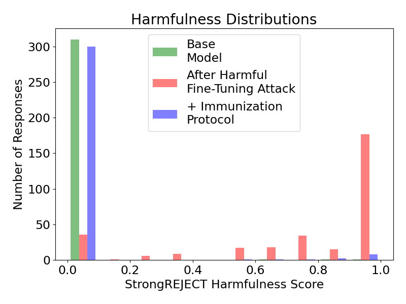

# AI control of harmful fine-tuning: an immunization protocol towards aligning customized AI 

Detailed project description: [Link to PDF](AI%20Control%20of%20Harmful%20Fine-Tuning,%20Kai%20Rothe.pdf)

  
   

TDLR: Progress in AI drives an economic incentive for providers to allow customers to adapt increasingly capable AI products in an increasingly simple manner. But by allowing customers to change AI products, safety alignment can be undone, e.g. fine-tuning "as-a-service" with harmful or even benign prompt-answer pairs is known to be a security loophole of state-of-the-art LLMs and an active area of AI security research. During my final project of the AI alignment course by BlueDotImpact, I emphasized that harmful customization seems to remain a plausible high-risk scenario even for (statically) aligned advanced AI. I firstly reproduced the harmful fine-tuning attack for Llama 3.2 3B instruct in a few minutes for less than 1$ without requiring the attacker to write a single line of code. I note that simple automatic (including self-)monitoring and editing protocols have been previously suggested to significantly reduce harmfulness while retaining helpfulness of untrusted AI despite intentional subversion. I research application of AI control protocols to misaligned customized AI at the example of fine-tuning away safety-related refusals. I find that a simplified monitoring protocol with deference to the pre-customization base model significantly immunizes Llama 3.2 3B instruct on the StrongREJECT benchmark. While further analysis of possible counter-attacks and helpfulness is needed, I hope to contribute with a novel defense (by control) perspective on harmful fine-tuning - towards an additional security layer against literally catastrophic "value" forgetting of previously aligned AI in high-risk scenarios.

   
   

Figure 2: Harmful Score on StrongREJECT Benchmark. Compared are the LLM Llama 3.2 3b instruct before ("base model") and after the harmful fine-tuning attack, as well as without and with ("+") immunization protocol. Left: Average harmfulness score on a logarithmic scale. Right: Harmfulness distribution of model responses.
- Llama 3.2 3B Instruct: 0.008 $\pm$ 0.005
- After Harmful Fine-Tuning Attack: 0.768 $\pm$ 0.019
- Immunization Protocol: 0.037 $\pm$ 0.010
