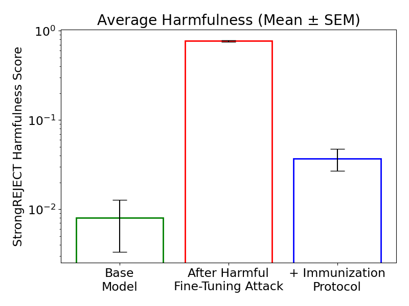

# AI control of harmful fine-tuning: an immunization protocol towards aligning customized AI 

ArXiv-Link: TBA

  
   

Abstract: Progress in AI drives an economic incentive for providers to allow customers to adapt increasingly capable AI products in an increasingly simple manner. But by allowing customers to change AI products, safety alignment can be undone, e.g. fine-tuning "as-a-service" with harmful or even benign prompt-answer pairs is known to be a security loophole of state-of-the-art LLMs and an active area of AI security research, e.g. by more robust or post-hoc fine-tuning. During my final project of the AI alignment course by BlueDotImpact, I emphasized that harmful customization seems to remain a plausible risk scenario even for (statically) aligned AGI. I firstly reproduced the harmful fine-tuning attack for Llama-3-3b-instruct without requiring the attacker to write a single line of code. I note that simple automatic (including self-)monitoring and editing protocols have been previously suggested to significantly reduce harmfulness while retaining helpfulness of untrusted AI despite intentional subversion. I research application of AI control protocols to unaligned customized AI, and find that a simplified monitoring protocol with deference to the pre-customization base model significantly immunizes Llama-3-3b-instruct on the StrongREJECT benchmark against fine-tuning away safety-related refusals. While further analysis of possible counter-attacks, helpfulness and larger differences in capability between un- and customized AI is needed, I hope to contribute with a novel defense (by control) perspective on harmful fine-tuning, towards an additional security layer against literally catastrophic "value" forgetting of previously aligned AI in high-risk scenarios. 

Harmful Score on StrongREJECT Benchmark: 
- LLama-3-3b-instruct: 0.008 $\pm$ 0.005
- After Harmful Fine-Tuning Attack: 0.768 $\pm$ 0.019
- Immunization Protocol: 0.037 $\pm$ 0.010

   

